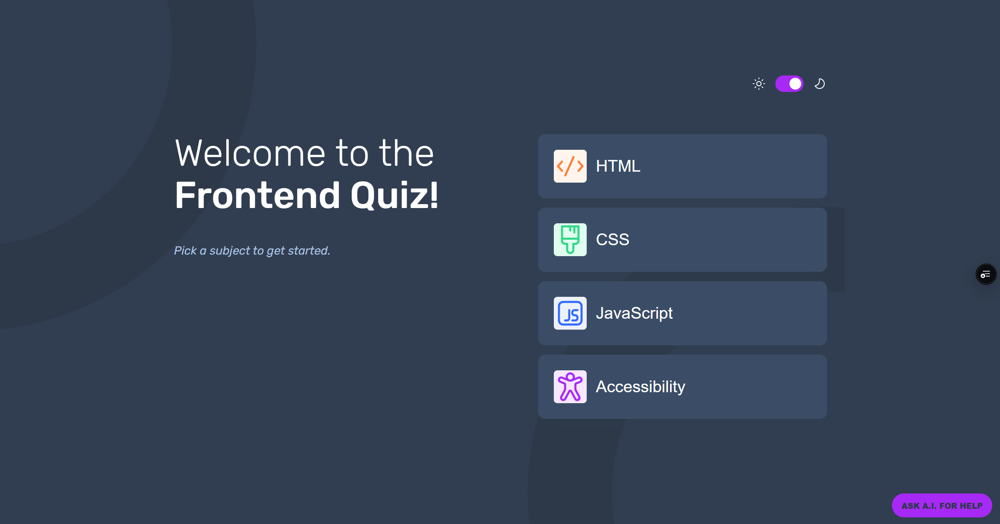

# Interactive Frontend Quiz with AI Helper

This project is an interactive quiz website focused on frontend web development topics (HTML, CSS, JavaScript, and Accessibility). It was built to improve my understanding of frontend concepts and explore integrating AI into web applications, particularly learning how to integrate an AI chatbot as a popular modern feature.

The AI "Quiz Helper Bot" is available to assist users with questions related to the quiz content.

**Live Demo:** [https://frontend-quiz-app-main-jet.vercel.app/](https://frontend-quiz-app-main-jet.vercel.app/)

## Screenshot

## Key Features

* Interactive quizzes on four frontend topics: HTML, CSS, JavaScript, and Accessibility.
* Questions and answers dynamically fetched from a `data.json` file.
* AI-powered "Quiz Helper Bot" using the Google Gemini API to provide assistance.
* Theme switcher (dark/light mode).
* Score tracking and results display upon quiz completion.
* User-friendly interface.

## Technologies Used

* **Frontend:** HTML, CSS, Vanilla JavaScript
* **Backend (Serverless Function):** Node.js (for Vercel serverless functions, using `22.x` as project build environment preference specified in `package.json`). The `api/gemini-chat.js` function handles the AI interaction.
* **AI:** Google Gemini API (via the `@google/generative-ai` npm package).
* **Data Management:** Quiz content managed via a local `data.json` file.
* **Deployment:** Vercel (configured with `{"version": 2}` in `vercel.json`).

## How to Use the Application

1.  From the homepage, select a quiz topic (HTML, CSS, JavaScript, or Accessibility).
2.  Answer the multiple-choice questions.
3.  Submit answers and view your score.
4.  At any point, click the 'Ask A.I. for help' button to open the Quiz Helper Bot and ask questions related to the quiz content.

## API Endpoint & Environment Variables

The frontend communicates with a serverless API endpoint (typically `/api/gemini-chat`) to interact with the Gemini AI.

If you intend to deploy this project yourself, you will need to:
1.  Obtain an API key from Google AI Studio for the Gemini API.
2.  Set this key as an environment variable named `GEMINI_API_KEY` in your Vercel project settings.